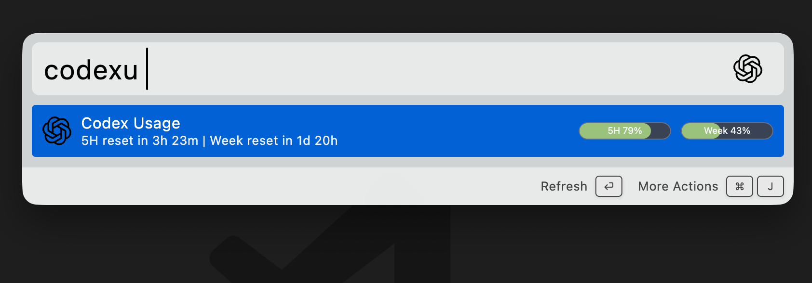

# Codex Usage

A Wox plugin that shows local Codex usage inside the launcher.



## What It Reads

- Live account and rate-limit windows from `codex app-server`
- Local account fallback from `~/.codex/auth.json`
- Local history totals from `~/.codex/state_5.sqlite`

## Trigger Keywords

- `cusage`
- `codexu`

## Install

```bash
wpm install Wox.Plugin.CodexUsage
```

## Build

```bash
pnpm install
pnpm build
```

## Notes

- The plugin is inspired by the local-first approach used by [steipete/codexbar](https://github.com/steipete/codexbar).
- It prefers official local Codex JSON-RPC data over screen-scraping `/status`.
